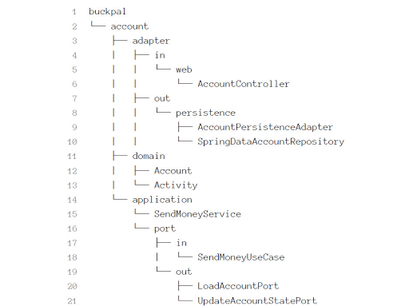

# About the application

Chess-books-app is application developed for purposes of Java internship.
Users of this application can view books related to chess and make an order.

## Hexagonal architecture

Application is implemented in Hexagonal architecture style meaning that the core of the application is made up of:
* domain objects, 
* use cases that operate on them
* input and output ports that provide an interface to the outside world.

Outside of the hexagon are various adapters that interact with the application.

**Domain objects** don’t have any outward dependency.
They’re pure Java and provide an API for use cases to operate on them.
Because of this, changes in other layers don’t affect them.

**Use cases** are abstract descriptions of what users are doing with our software.
Similar to the domain objects, a use case class has no dependency on outward components.
When it needs something from outside of the hexagon, an output port must be created.

Every communication to and from the outside happens through dedicated **ports**. 
An **input port** is a simple interface that can be called by outward components and that is implemented by a use case. 
An **output port** is simple interface that can be called by our use cases if they need something from the outside (database, for instance).

The **adapter** form the outer layer of the hexagonal architecture. 
They are not part of the core but interact with it. 
**Input adapters** call input ports to get something done.
**Output adapters** are called by use cases and might, for instance, provide data from database.

## Package structure

Each element of the architecture can directly be mapped to one of the packages.
On the highest level is a package named account for instance, indicating that this is the module implementing the use cases around an Account. 

**Domain package** contains domain model.

The **application package** contains a service layer around this domain model.
Service should implement incoming port interface and use the outgoing port interface.
Outgoing port interfaces are implemented by the persistence adapter.

The **adapter package** contains the incoming adapters that call the applications layers’ incoming ports and the outgoing adapters that provide implementations for the application layers’ outgoing ports.

# Adding new features

For every new feature developed for the application, it’s necessary to create new branch with the same name as the task assigned in Jira.
When finished coding, you create pull request.
Code needs to be reviewed by teammates first.
If approved, it’s sent for another approval to mentors on project.
If code passed both approvals, it’s merged with main branch.

# How to run the app?
You’ll need [Java  17](https://www.oracle.com/java/technologies/downloads/) and [Apache Maven 3.8.5](https://maven.apache.org/download.cgi) or above installed.
To start the application run following command in terminal from root folder:

`mvn spring-boot:run`
